# 1. ARP

这里可以通过ARP攻击对目标进行断网、数据劫持、监听等。

## 1.1. APR介绍

ARP（Address Resolution  Protocol）是一种TCP/IP协议，用于根据IP地址获取物理地址。在计算机发送信息时，如果需要知道目标IP地址的物理地址，就会使用ARP协议。该协议会通过将目标IP地址广播到局域网上的所有主机，并接收返回的消息来获取目标物理地址。一旦收到返回的消息，计算机就会将该IP地址和物理地址存入本机ARP缓存中，以便下次请求时直接查询，从而节约资源。

### 1.1.1. ARP工作原理

每台主机都会在自己的ARP缓冲区中建立一个ARP列表（地址转换表），以表示IP地址和MAC地址的对应关系。

当源主机需要将一个数据包发送到目的主机时，会首先检查自己的ARP列表中是否存在该IP地址对应的MAC地址。如果有，就直接将数据包发送到这个MAC地址；如果没有，就向本地网段发起一个ARP请求的广播包，查询此目的主机对应的MAC地址。这个ARP请求数据包里包括源主机的IP地址、硬件地址，以及目的主机的IP地址。

网络中所有的主机收到这个ARP请求后，会检查数据包中的目的IP是否和自己的IP地址一致。如果源主机一直没有收到ARP响应数据包，表示ARP查询失败。

### 1.1.2. APR欺骗工作原理

由于地址解析是建立在网络中各个主机互相信任的情况下，在局域网中主机可以自行的发布ARP的应答信息，简单来说，如果网络中有其他主机需要自己的mac地址，那么这台主机会主动将自己的mac地址发布出去，而需求主机并不会对该数据报文的真实性进行校验，而是会直接存入自己的ARP缓存中，而这样的情况下就会导致攻击者就可以对某一台主机的ARP应答报进行伪造，从而导致这台主机在进行访问的时候出现报错或者无法通信的情况。

## 1.2. 环境准备

这里一定要注意哦，后续使用到kali，一定要使用桥接，简单来说，只要是虚拟机测试，一定都使用桥接，确实所有设备都处于一个局域网中。

|     设备名称      |    IP地址    |
| :---------------: | :----------: |
| 网关(WiFi路由器)  | 192.168.2.1  |
|    kali 虚拟机    | 192.168.2.10 |
| Windows 10 虚拟机 | 192.168.2.20 |
|      IPhone       | 192.168.2.2  |
|      物理机       | 192.168.2.3  |

## 1.3. 适用场景

如果你在宿舍，你的舍友大半夜打游戏，很吵，别想，直接使用ARP断网攻击。

如果你在宿舍，你的舍友大半夜手机发出奇怪声响，你找他要网址，他不说，别想，直接使用ARP数据劫持。

如果你在宿舍，你的舍友大半夜看女友照片，你也想看，他不给，别想，直接使用图片捕捉。

如果你在宿舍，你的舍友大半夜偷偷上网课，你想拖他一起打游戏，别想，直接使用DNS劫持。

# 2. ARP断网攻击演示

这里我准备了虚拟机以及手机来进行测试，由于家里确实没有第二台电脑了，只能使用这种方式了。

## 2.1. 使用kali进行演示

这里使用kali进行演示。

### 2.1.1. nmap判断存活

使用nmap判断局域网内存活IP，当然判断局域网中存活IP方式有很多，这个没什么好说的，好家伙IPhone搜不到？？？？？什么鬼，

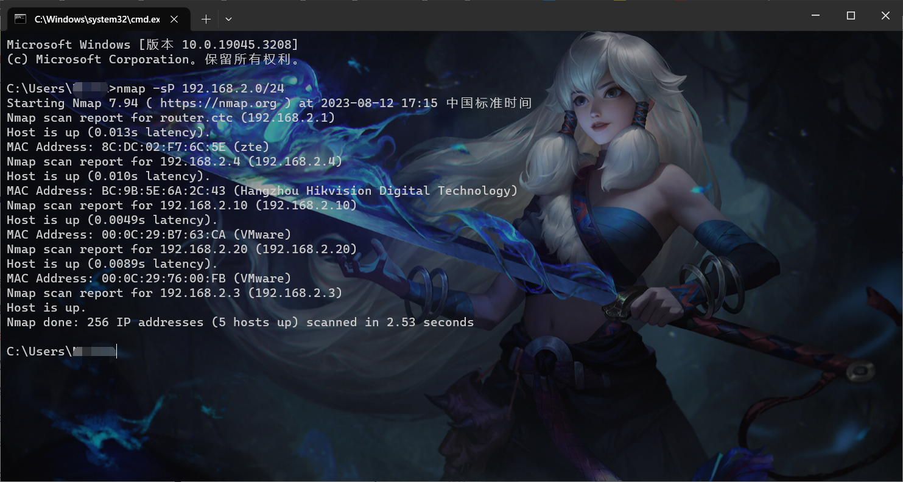

### 2.1.2. 安装工具

在kali中是自带aprsoof的，但是我发现好像还是需要自己重新安装，并不是纯正自带的那种。

```
sudo apt-get install dsniff
```


### 2.1.3. 攻击Windows 10虚拟机

这里我就攻击Windows 10 虚拟机，这里还需要看一下你的kali配置的局域网地址是在哪个网卡上。

```
arpspoof -i eth0 -t 192.168.2.20(目标IP) 192.168.2.1(网关IP)
```


#### 2.1.3.1. 查看效果

可以看到，我在测试开始的时候去ping百度还是ok的，但是开启攻击后，再去ping百度就无法访问了。


### 2.1.4. 攻击IPhone

这里也是同样的手法。

```
arpspoof -i eth0 -t 192.168.2.20(目标IP) 192.168.2.1(网关IP)
```

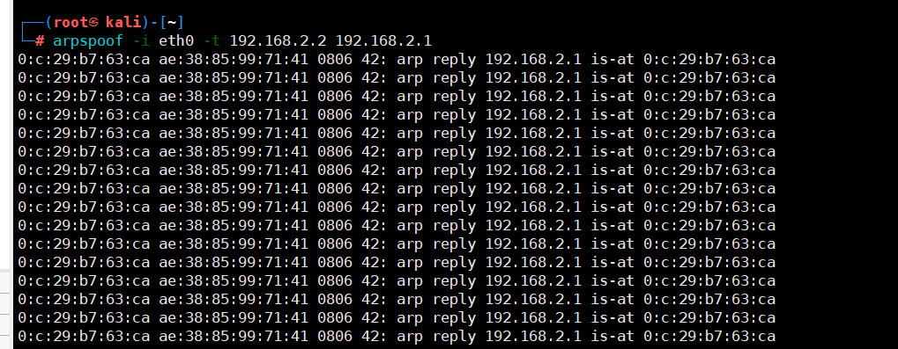

#### 2.1.4.1. 查看效果

可以看到开始攻击后，访问百度就无法通信了。


结束攻击后，手机恢复访问。


## 2.2. 使用Windows进行演示

这里使用Windows进行演示，前置存活判断，什么的就不操作了，不过这里还是要说一下，测试完发现，好像Windows版的并不能生效,也有可能是我使用的方式不对，所以这里，我就使用科来。

### 2.2.1. 工具获取

在Windows中也是有这个工具的，可以直接去github上下载，我建议直接使用克科来吧，方便。

[arpspoof](https://github.com/alandau/arpspoof/releases/tag/v0.2)

[科莱](https://www.colasoft.com.cn/download/capsa.php)

### 2.2.2. 科来工具

这里打开科来后，就是这样的，然后开始抓包。


### 2.2.3. 抓包过程

这里我们进行抓包，为什么要抓包，是由于好像新版的数据包生成器缺少一些数据，导致无法进行ARP攻击，这里抓包抓一会，看看有没有ARP协议的数据包，我们就基于这个数据包进行数据修改，如果没有直接ping就会出现数据包，这里我们点开双击我箭头的数据包。

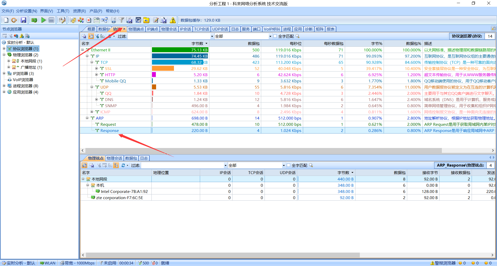

#### 2.2.3.1. 导入数据

这里我们双击后就能够看到一个数据包的窗口，随便选择一条ARP数据包选择导入数据包生成器中。


#### 2.2.3.2. 修改数据

这里我们需要修改里面的数据，不会有人还不知道怎么查电脑上的ARP信息吧，通过ARP信息可以获取到我们要攻击的MAC地址以及IP地址，诶，这里我就不说ARP信息怎么查。在本地cmd输入arp -a即可，找到你目标主机的MAC地址与IP地址即可。

```
以太网-||
目的地址：00:bb:60:7b:a1:92    ##被攻击者MAC地址，这里默认中间是-要替换为:
源地址：随便设置        ##如果设置自己的容易被抓。
地址解析协议
发送者MAC地址：随便设置  ##要和上面的源地址相同。
发送者IP地址：写网关
目标MAC地址：00:bb:60:7b:a1:92 ##被攻击者MAC地址，这里默认中间是-要替换为:
目标地址：192.168.2.20  ##被攻击者的IP地址
```

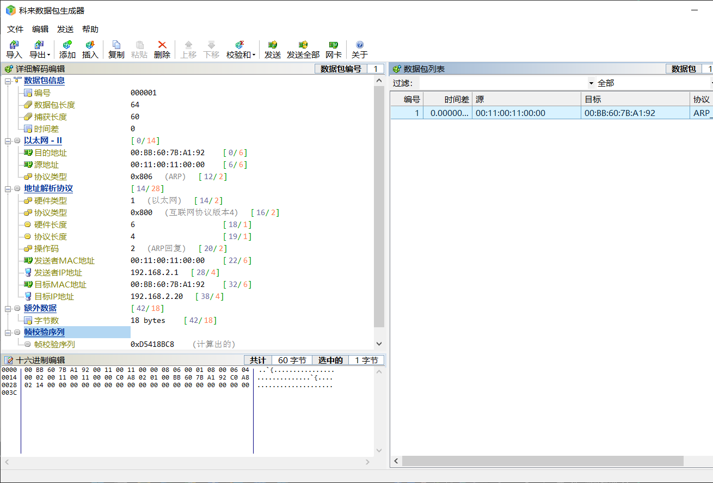

#### 2.2.3.3. 发送数据

点击发送，然后选择网卡，都勾选上，设置0次，也就是无限循环。

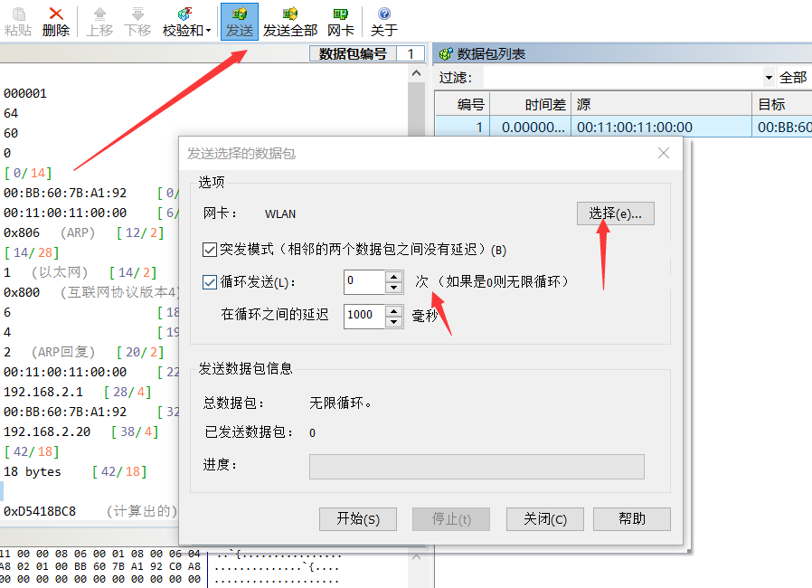

#### 2.2.3.4. 查看效果

可以看到目标无法上网了，但是这里好像有点小问题哦，就是我结束攻击后，好像网络还是无法恢复，需要重启才能解决。

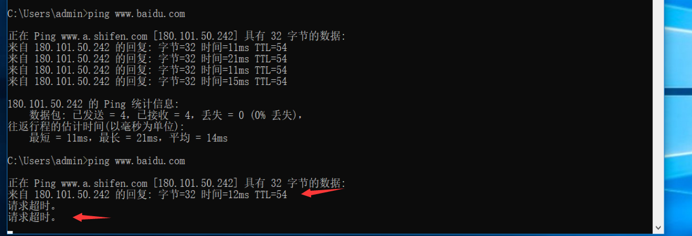

# 3. ARP数据劫持

ARP数据劫持，简单来说就是监听目标主机访问了那些网站，这里还有一个问题就是IPhone的数据获取起来比较麻烦，而且基本上获取不到，不知道其他手机是不是这样的，但是电脑都能够成功获取到。

## 3.1. 使用kali进行演示

这里同样使用kali进行演示。

### 3.1.1. 开启转发

由于我们需要的是获取目标主机访问的数据，而不是让他无法上网，使用这里我们需要将kali上的端口转发开启。编辑 Kali Linux 虚拟机`/etc/sysctl.conf` 配置文件，将`net.ipv4.ip_forward`配置项取消掉“`#`”注释符号，并将其值由 0 改为 1 即可开启端口转发。当然也可以使用命令：

```
echo 1 >> /proc/sys/net/ipv4/ip_forward   
```


### 3.1.2. 测试是否正常

这里还是使用工具进行攻击，查看目标主机是否能够正常上网，若能够正常上网，那么设置就是成功的，不过这里需要注意，前后的位置需要调换一下。

```
arpspoof -i eth0 -t 192.168.2.1(网关IP) 192.168.2.20(目标IP) 
```


### 3.1.3. 攻击Windows 10虚拟机

这里我们使用WireShark进行监听，由于没有kali版的科来，所以就使用WireShark来操作吧。

#### 3.1.3.1. 默认数据

首先将之前测试的攻击暂停，我们来看一下，默认情况下WireShark抓Windows 10虚拟机是那些数据，可以看到默认情况下，是抓不到数据的，我这个图是我使用ping进行测试的。

```
ip.addr==192.168.2.20
```


#### 3.1.3.2. 开启数据转发

这里我们将攻击开启，再来看看WireShark抓取到的是那些数据，可以看到抓取到了很多数据，其实这个就是通过端口转发来进行抓取，目标主机再访问过程中，丝毫无感，但是所有的数据都从你电脑上经过，相当于你是一个中间件，对数据进行捕捉，只不过使用WireShark抓取到的数据确实，有点看的麻烦。

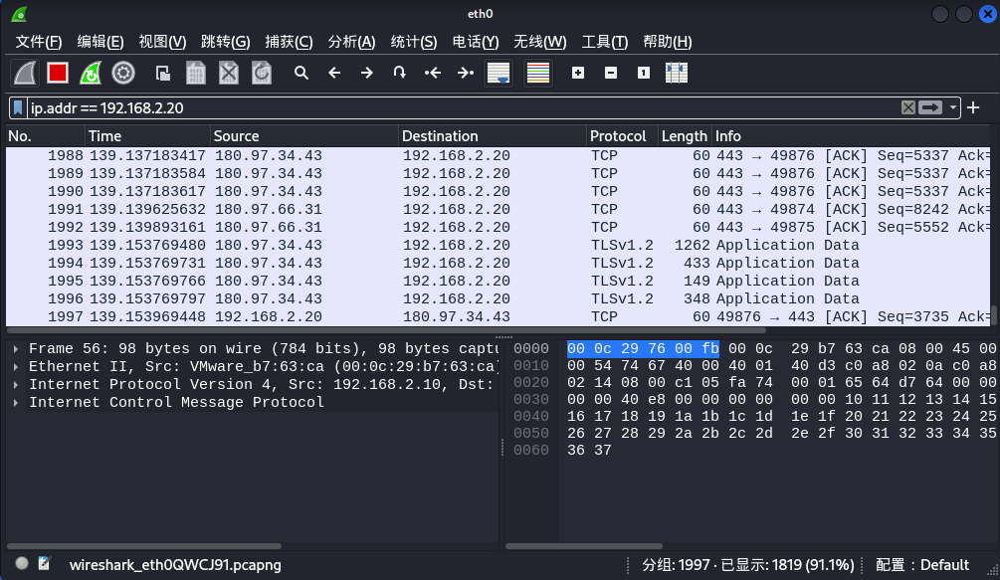

## 3.2. 使用Windows进行演示

这里我们使用科来进行分析查看，因为科来更加的直观，不过提前说，我的思路有不同的变化，这里应该使用Windows就能够实现的，但是可能由于IPhone的原因，导致未成功实现该操作，但是也抓取到数据了，只是无法转发。

整体思路，使用Windows工具，无法通行，切换到kali上操作，和上面的操作是一样的，由于转发数据就要出去，而kali安装在我物理机上，就可以实现我直接抓数据就可以了，数据的IP依旧是IPhone的地址，因为kail将数据转发了，所以我才能抓取到。

可能有点绕，还需要慢慢理解。

### 3.2.1. 攻击IPhone

这里我们选择IPhone来进行操作，由于是虚拟机的问题，导致如果使用Windows 10虚拟机的话，所有的流量默认都是走我网卡出去的，所以都能监听到，所以就使用IPhone来操作，这里的默认操作我就不演示了，直接看效果吧。

#### 3.2.1.1. 开启攻击

这里和可惜的是，我没第二台电脑，但是IPhone又无法欺骗........准确说，直接ping不通，但是不知道为什么linux上能够实现，严重怀疑Windows版的这个工具，是先进行连通性测试，然后在进行攻击，而kali中可能是直接开启攻击，所以导致Linux可以，Windows不可以的情况。这里我就替换一下linux吧，然后抓kail的数据包，来看看能不能获取到。


#### 3.2.1.2. 查看效果

可以看到成功获取到数据了，唯一的问题就是好像数据不转发了。

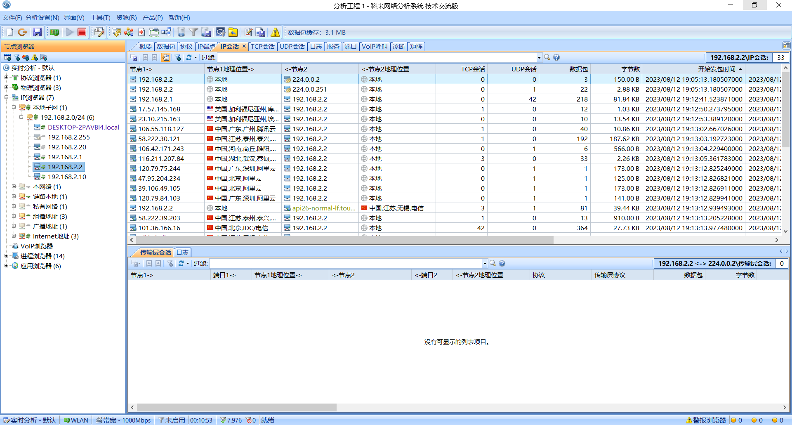

## 3.3. 图片捕捉

由于前面我们都是获取的是数据，而且数据中的图片是无法获取的，那么这里就使用工具对目标主机访问的网站的图片进行获取。

### 3.3.1. 安装工具

这里依旧是使用kali来实现，Windows上好像是没有这样的工具的，kali老版本这些工具都有，但是新的版本好像都需要自己下载，也不知道是不是我没更新包导致的。

```
sudo apt install driftnet
```

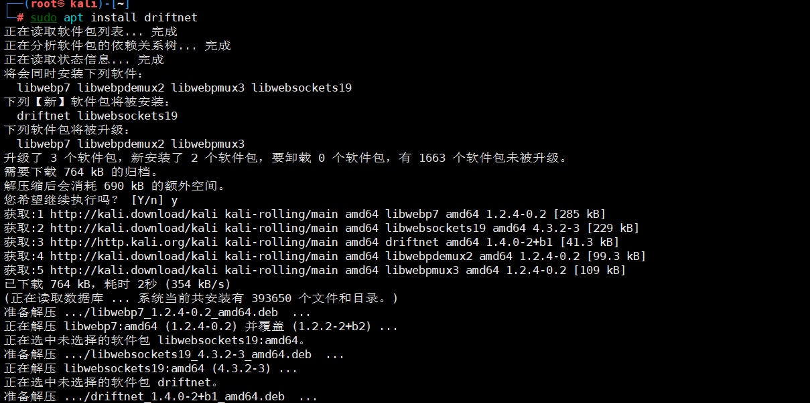

### 3.3.2. 工具语法

```
driftnet [options] [filter code]
-b	捕获到新的图片时发出嘟嘟声
-i	interface 选择监听接口
-f	file 读取一个指定pcap数据包中的图片
-p	不让所监听的接口使用混杂模式
-a	后台模式：将捕获的图片保存到目录中（不会显示在屏幕上）
-m	number 指定保存图片数的数目
-d	directory 指定保存图片的路径
-x	prefix 指定保存图片的前缀名
```

### 3.3.3. 开启演示

这里我们来获取Windows 10上的图片，看看是否能够获取到。

#### 3.3.3.1. 开启数据转发

这里同样进行数据转发。

```
arpspoof -i eth0 -t 192.168.2.1(网关IP) 192.168.2.20(目标IP) 
```

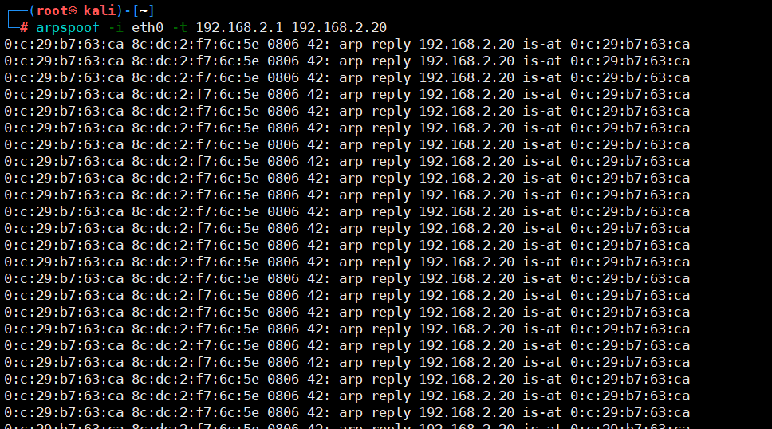

#### 3.3.3.2. 开启捕捉图片

```
driftnet -i eth0 -a -d /root/heihei
```

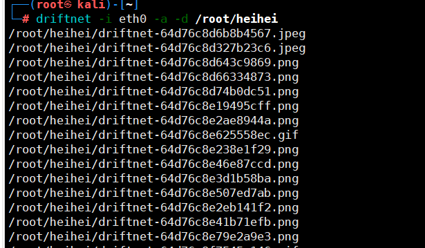

#### 3.3.3.3. 查看效果

可以看到在kali的文件夹下，出现了很多的图片，这写就是在访问的时候出现的一些图片。


## 3.4. 密码捕捉

这里的前置都不操作了，都是一样的，这里为了方便，找一个小网站来测试。

### 3.4.1. 安装工具

```
sudo apt install ettercap-graphical
```

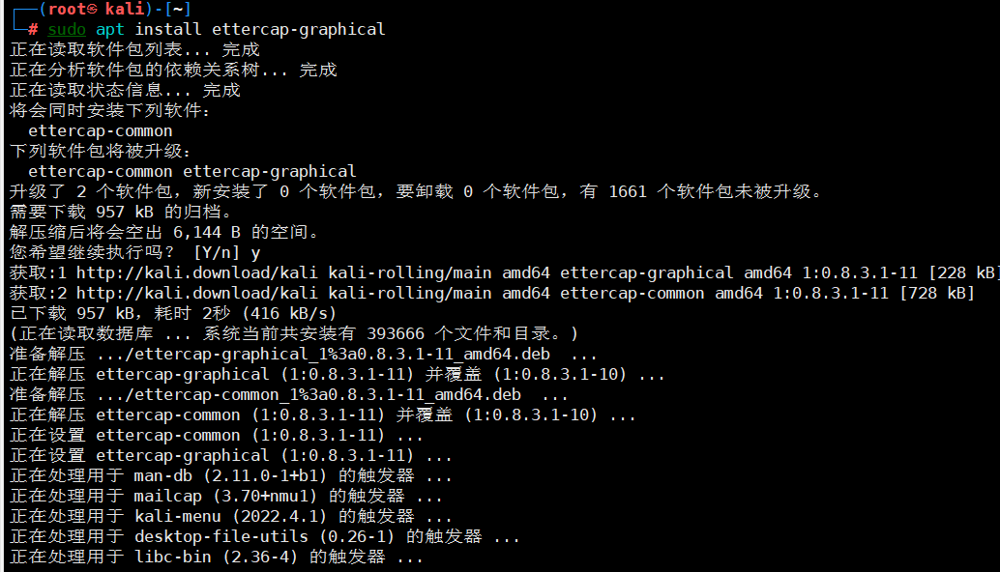

### 3.4.2. 工具语法

语法不一定全，可自行百度搜索，或者使用工具的帮助手册。

```
-l	显示可用网卡接口设备
-i	选择接口
-t	协议选择，tcp/udp/all，默认为all
-p	不进行毒化攻击，用于嗅探本地数据包
-L	载入过滤器文件
-V	text 将数据包以文本形式显示在屏幕上
-L	filename 把所有的数据包保存下来（保存后的文件只能用etterlog显示）
```

### 3.4.3. 开启演示

由于我这里并未测试成功，所以这里说一下整体思路，首先开启数据包的转发，然后再开启工具的捕捉，再目标机器上找一个网站进行登陆，需要注意的是，一定要是账号密码登陆，如果验证码登陆你还是无法登陆的，我们要获取的是账号密码。

这里我放一张别人的图片吧。

其实主要原因是，我电脑蓝屏了，可能开的虚拟机太多了，然后攻击的太频繁了，把我电脑干趴了，尴尬.....

```
ettercap -Tq -i eth0
```


# 4. DNS劫持攻击

由于DNS在查询的时候是一个很复杂的流程，所以这里简单说说吧，想了解的，可以自行百度搜索。

例如我们去访问百度的时候，浏览器首先会检查浏览器自身中的缓存记录中是否存在该域名的dns解析记录指向，如果没有，那么就会去查询操作系统中的DNS解析记录，如果还是没有，就会去本地是HOST文件去查询，倘若寻找了一圈均没有记录，那么浏览器会向电脑中的网卡上设置的DNS服务器去发送域名解析的请求，如果还是没有查询到，那么本地的DNS服务器会代替我们本地的浏览器向全球13个根域名服务器去发送查询请求。

这就是一个完整的流程，至于13个根域名服务器如何去查询，那我就不知道了，而且也没统一的资料查询。

## 4.1. 查询DNS缓存

浏览器中的缓存的查询方式都不一样，建议可以直接百度搜索，操作系统的缓存可以通过命令来查询。

```
ipconfig /displaydns  ##查询DNS缓存
ipconfig /flushdns  ##刷新DNS缓存
```


## 4.2. DNS劫持攻击过程

这里就开始演示DNS劫持攻击过程，依旧是使用上述的靶机，倒霉蛋依旧是我们的Windows 10虚拟机。

### 4.2.1. 修改配置文件

这里我们要修改一下kali中 ettercap工具的DNS解析，确实也就是将流量转发到这个你设定的假网站上。

```
vim /etc/ettercap/etter.dns  ##配置文件地址
修改内容：
* A 192.168.2.10      ##星号就代表匹配所有，A就是A记录，192.168.2.10就是kali攻击机的地址，当然你也可以使用公网IP。

其他类型：   ##以下均可以配置，这个是针对性的
www.*.com A 192.168.2.10
*.baidu.com A 192.168.2.10
*.*.com A 192.168.2.10
```


### 4.2.2. 启动网站

这里我是做演示的，直接使用kail自动的本地网页测试即可，这里我也不修改了，直接使用默认，如果你想钓鱼等等，那么就可以对一些网站进行克隆部署即可。

```
service apache2 start 
```

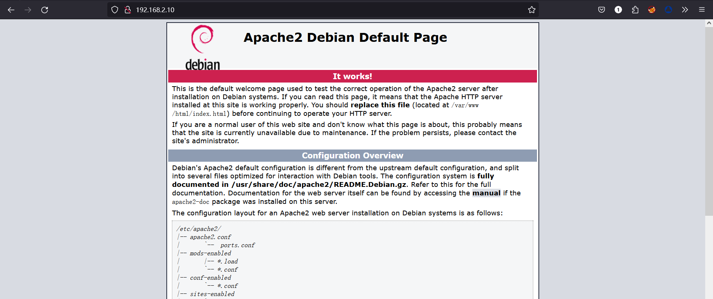

### 4.2.3. 工具配置

到这里就开始对这个ettercap工具进行配置了，由于工具是界面的，所以需要去kali机器上去运行。

#### 4.2.3.1. 选择网卡

这里我们默认即可，如果不对修改一些，如何确定即可。

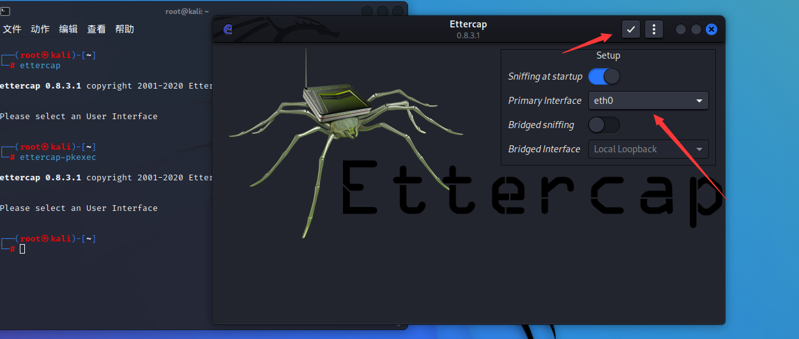

#### 4.2.3.2. 扫描主机

这里扫描一下存活主机，让其在列表中显示出来，由于新版的工具，操作相对来说没那么负载。

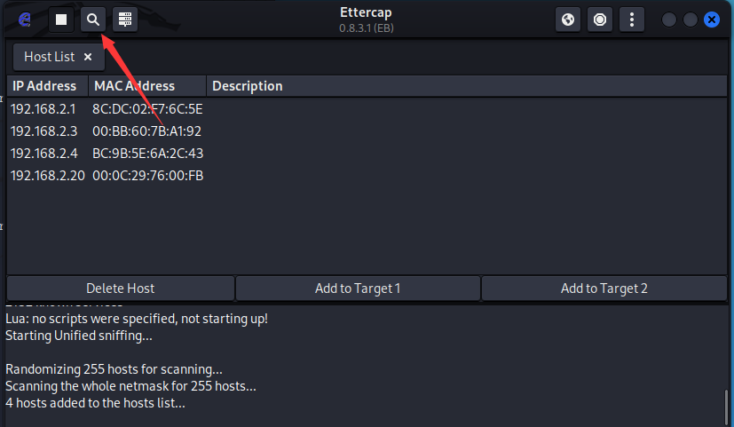

#### 4.2.3.3. 添加目标

这里将网关添加到Target1，目标主机添加到Target2。


#### 4.2.3.4. 选择ARP攻击

这里要选择ARP攻击，然后勾选远程攻击。

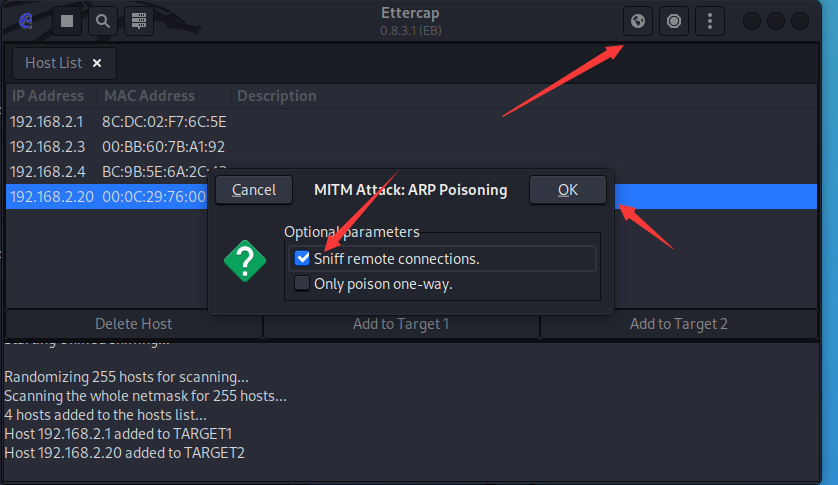

#### 4.2.3.5. 选择攻击插件

这里点三个小点子，选择Plugins》Manage~》勾选dns_spoof，然后在扫描主机左边有一个实体方框，那个就是开始攻击或关闭攻击的，开启就是实体方框，暂停就是一个播放的图标，可以看到我目前是开启状态，默认都是实时开启的。

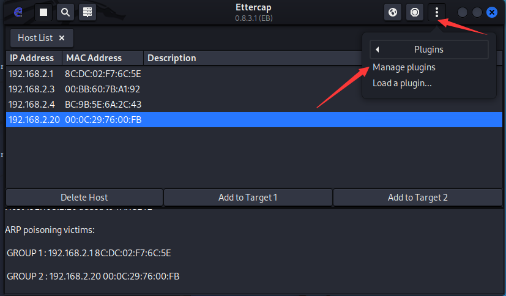

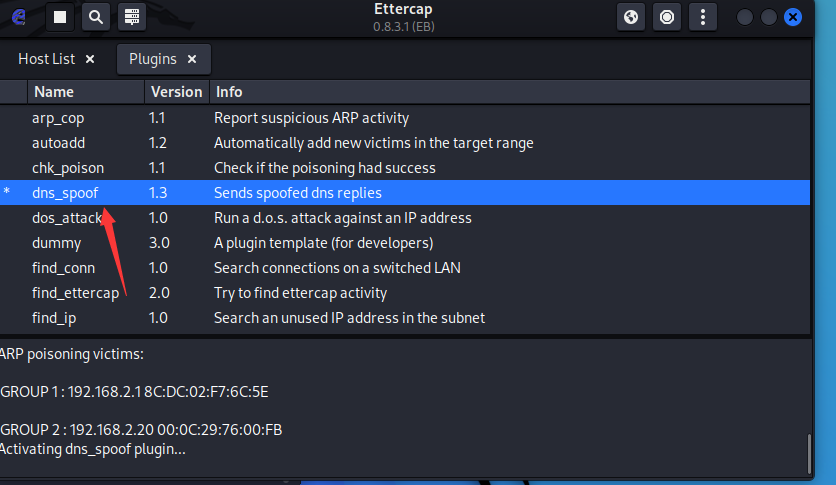

#### 4.2.3.6. 查看效果

可以看到，我们去访问百度，但是以及直接跳转到，我们设定的网站上了，

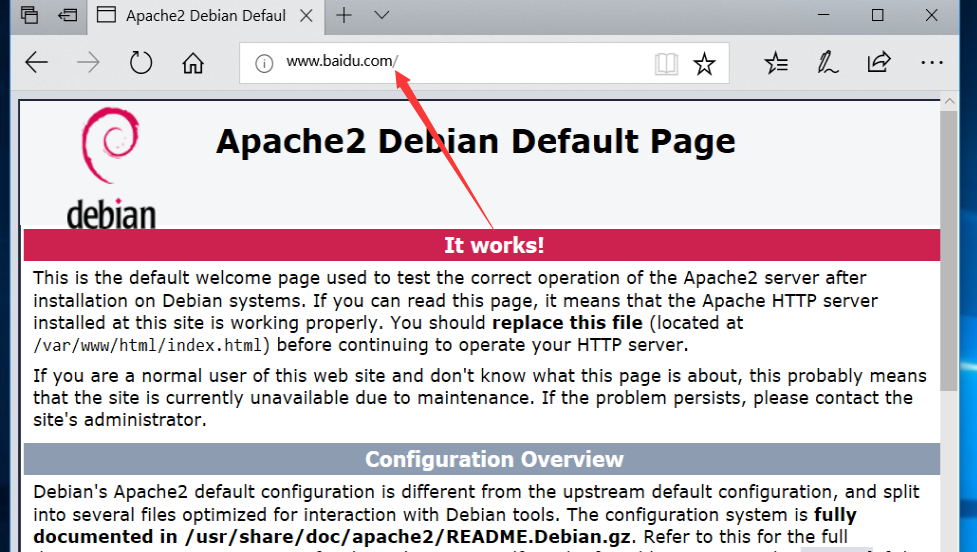

# 5. 安全防范

简单介绍一下防范。

## 5.1. APR攻击防范

由于ARP攻击基本上目标主机是无察觉的，主要你想，你正常能够上网，你可能会去排查ARP攻击什么的么，甚至可能部分人都不知道怎么查询ARP，所以关于ARP的攻击只能说，平时自己注意一点，提高警觉。例如：

1. 定期删除ARP缓存信息，使用arp -d清除缓存。
2. 有条件的绑定ARP信息。
3. 安装防火墙，部分防火墙或者杀毒软件能够再一定程度上拦截ARP攻击。
4. 最重要的是不要随便连接公开wifi。

## 5.2. DNS劫持防范

其实这里不单单是DNS劫持，关于DNS的攻击还有，DNS污染、DNS重绑攻击、DNS反射放大攻击等等，后续有空在添加一些。

1. 本地HOST文件配置，这里可以查一下本地的HOST文件有没有被修改，一些木马攻击后都会修改HOST文件，所有可以排查一些本地的HOST文件的配置。查询地址：**C:\Windows\System32\drivers\etc\HOSTS**

2. 网卡的DNS服务器地址有没有被篡改。

3. WiFi路由器的DNS服务器有没有被篡改，部分木马会对WiFi路由器进行攻击，例如弱口令爆破，如果WiFi路由器的密码简单，那么可能就会被修改，同时批量修改DNS就会导致解析出现问题。

4. 还有就是运营商DNS，默认情况下运营商会将你访问的地址强制跳转到某个DNS上进行解析，确保你的访问正常，同时屏蔽一些恶意网址。[查询运营商的DNS](https://nstool.netease.com/)

5. 安装杀毒软件，也可以降低一些DNS劫持的风险，部分杀毒软件是有专门对DNS修改进行检测的。

