# 1. HFish蜜罐介绍

HFish是一款社区型免费蜜罐，侧重企业安全场景，从内网失陷检测、外网威胁感知、威胁情报生产三个场景出发，为用户提供可独立操作且实用的功能，通过安全、敏捷、可靠的中低交互蜜罐增加用户在失陷感知和威胁情报领域的能力。

HFish支持基本网络 服务、OA系统、CRM系统、NAS存储系统、Web服务器、运维平台、安全产品、无线AP、交换机/路由器、邮件系统、IoT设备等90多种蜜罐服务、支持用户制作自定义Web蜜罐、支持流量牵引到免费云蜜网、支持可开关的全端口扫描感知能力、支持可自定义的蜜饵配置、一键部署、跨平台多架构，支持Linux x32/x64/ARM、Windows x32/x64平台和多种国产操作系统、支持龙芯、海光、飞腾、鲲鹏、腾云、兆芯等国产CPU、极低的性能要求、邮件/syslog/webhook/企业微信/钉钉/飞书告警等多项特性，帮助用户降低运维成本，提升运营效率。

## 1.1. HFish架构

HFish采用B/S架构，HFish由管理端（server）和节点端（client）组成，管理端用来生成和管理节点端，并接收、分析和展示节点端回传的数据，节点端接受管理端的控制并负责构建蜜罐服务。

在HFish中，**管理端**只用于**数据的分析和展示**，**节点端**进行**虚拟蜜罐**，最后由**蜜罐来承受攻击**。

HFish各模块关系图


# 2. 下载安装

首先这里可以直接去官网下载安装，主要我下载的是Windows的，不想折腾Linux，主要也就是安装的时候有些不同，其它使用也没啥不同的。

```
官网：https://hfish.net/#/2-3-windows
```

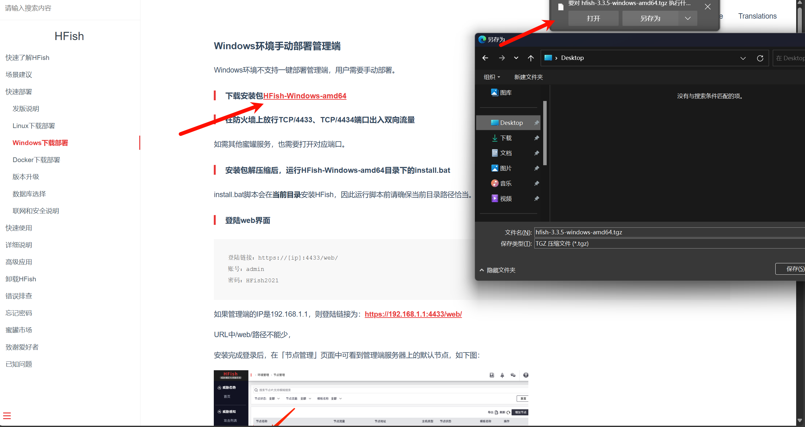

下载后是一个后缀.tgz的包，可以直接使用解压缩打开，里面有一个.bat的文件，直接运行即可，最后会弹出一个弹窗得到管理地址以及默认的账号密码，这需要注意如果是放在公网要及时修改密码。

```
管理地址：https://本机IP:4433/web/login
初始账号密码：admin/HFish2021
```


登录的时候一定需要将后面的URL地址输入，不然只加端口是无法出现登录的窗口，这里的账号密码就是初始给予的账号。

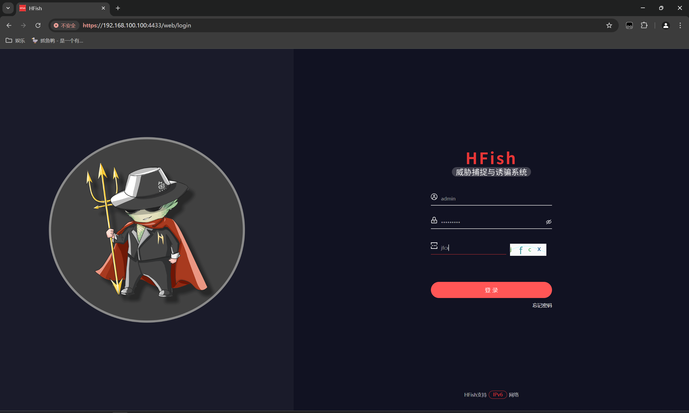

数据库的部署，根据官方的介绍，如若性能紧张，否则HFish官方强烈建议使用MySQL/MariaDB数据库！同时MySQL与MariaBD数据需要自行安装。

我这里直接使用SQLite的数据库来安装，这个就不需要自行创建，我这里为了方便就使用SQLite数据库了。这个类型主要影响一些场景，同时会影响数据的处理，而这里演示就简单就行了。

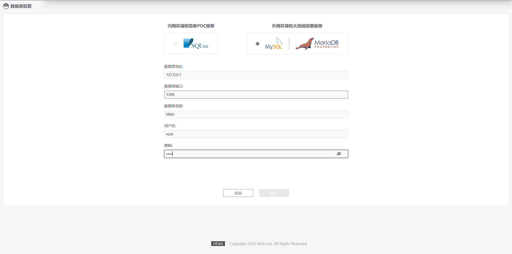

当然如果你觉得功能不够用或者处理数据能力较弱，那么可以在平台管理—系统配置—数据库配置处替换数据库类型，不过需要注意的是仅支持Fish只支持SQLite向MySQL/MariaDB数据库迁移，不支持反向迁移。

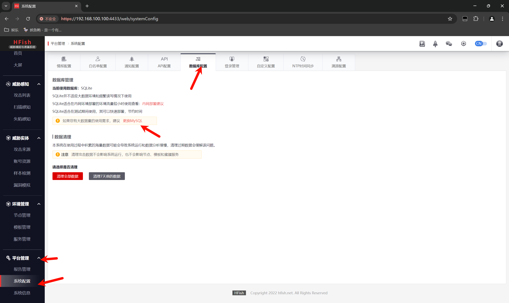

## 2.1. 安全配置

这里的安全配置一定是需要配置的，由于攻击者再不断攻击后，可能会察觉出来是蜜罐，那么可能会对蜜罐的部署的IP地址、端口、url进行测试，如果不进行安全配置，万一被成功攻破了，那么就被别人所利用了。

### 2.1.1. 创建用户

这里首先需要做的就是修改密码，最好越复杂越好，不要设定简单的密码，尤其是不要使用初始密码。

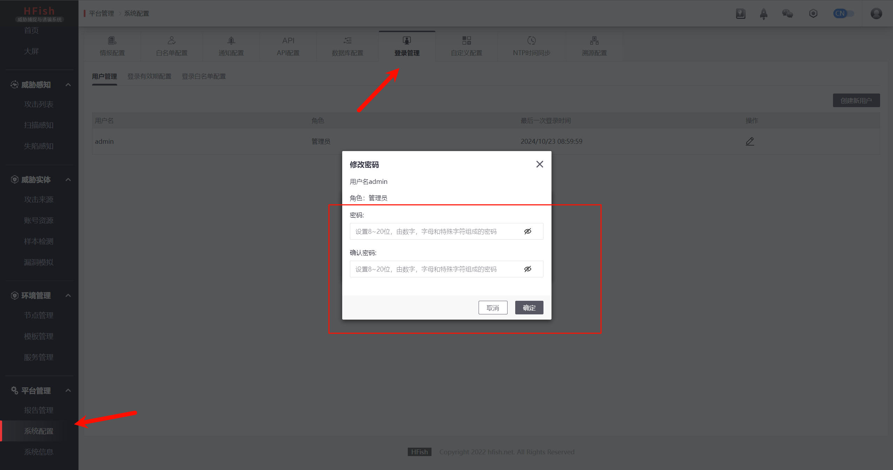

### 2.1.2. 登录管理

这里主要是防止本地的问题，在人离开的时候一定要锁屏或者自动退出，最好设置成5分钟左右。

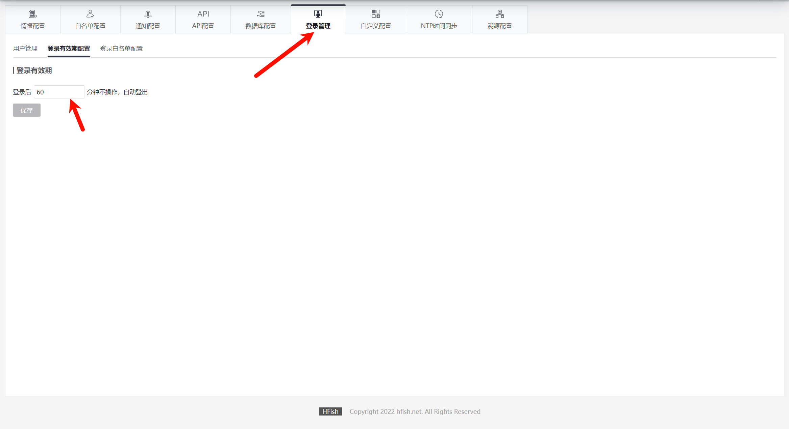

### 2.1.3. 登录白名单

这个是最重要的，一定要设置登录的白名单，如若是部署在公网的，可以填写你本地的出口IP地址，不过一般蜜罐正常也都部署在本地，所以就填写你本地的管理地址即可。一定要小，固定的几个IP登录。

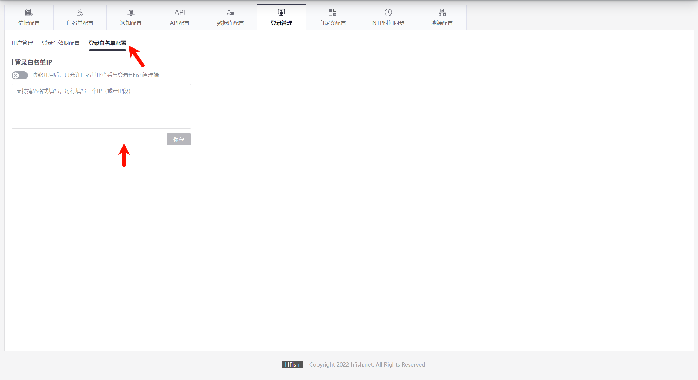

## 2.2. 溯源配置

这里需要注意溯源配置，默认是不打开的，由于溯源若开启，相当于当遭受到攻击后，蜜罐会对其进行反制溯源，自动开启对其攻击者的IP进行探查，会导致蜜罐成为攻击者，而在部分情况可能会收到一定的法律限制，例如对方是无意间访问到你，并且触发了漏洞，你对别人溯源，就会导致误会出现，所以默认是关闭的。

同时如果是在内网中也没必要开启这个功能，基本上内网中获取到IP后，通过交换机路由器也能很快的查找到具体的人员。

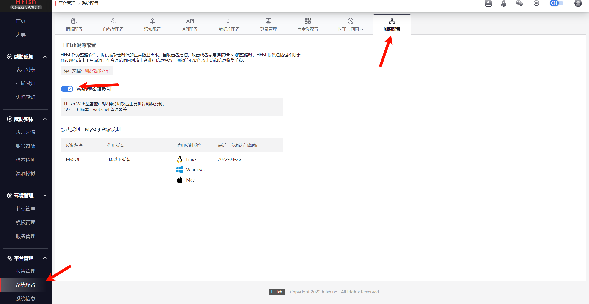

## 2.3. 扫描感知

如果使用Windows来搭建蜜罐的话，需要手动安装WinPcap来进行监测，否则Windows这个功能是无法使用的，下载后在蜜罐主机上安装即可。

安装后需要手动开关一次扫描感知。

```
WinPcap官方链接：https://www.winpcap.org/install/bin/WinPcap_4_1_3.exe
```

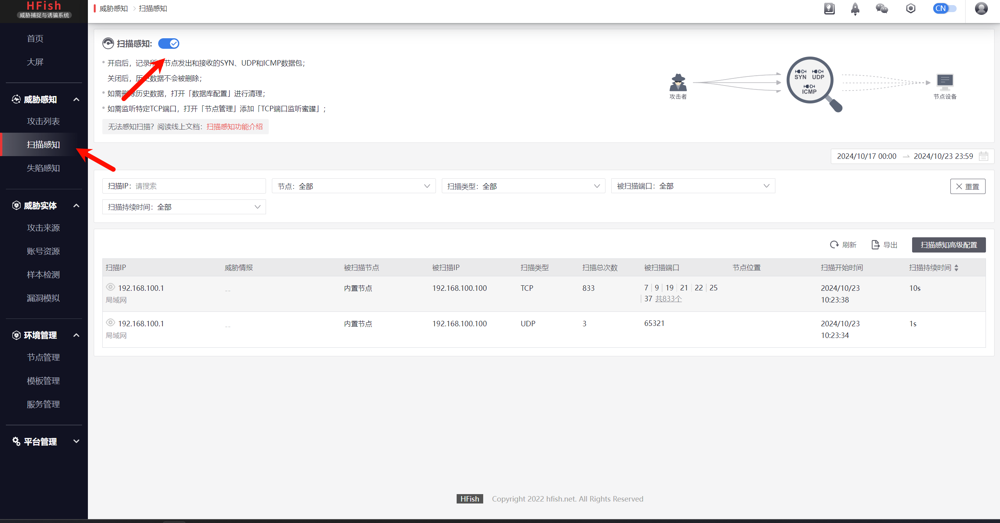

# 3. 蜜罐使用

在使用中我也就说一些常用的，基础的了解一些，更深入的可能还需要去官网找手册，同时我找了一下手册，可能官网手册也没更新，有些界面和手册中的界面位置替换掉了，所以使用还需要注意。

## 3.1. 首页查看

在首页上能够查看到各类情况，但是你会发现我有一个蜜罐掉了，到后面会提到这个蜜罐为什么会离线。

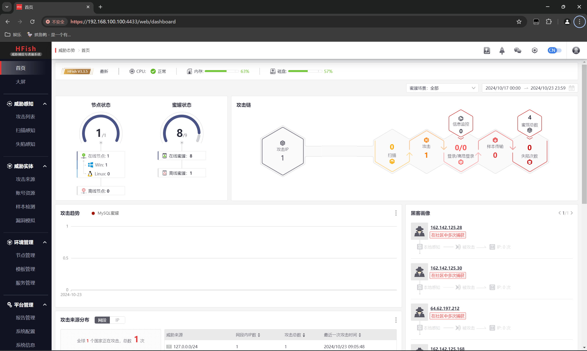

## 3.2. 节点管理

当安装好后，默认会部署一些蜜罐等待攻击者，这里主要需要看节点管理、模板管理、服务管理。主要还是在节点管理中，我们可以点击展开查看一下具体情况。

这里还需要注意我是使用Windows系统来部署的，需要记得手动将防火墙关闭，否则再后续的很多业务端口中都需要手动放开挺麻烦的，同时主要蜜罐有条件的话一定要和业务网隔离开，相当于蜜罐就算瘫痪了也不会影响到业务。这是重点，千万不能将蜜罐部署在业务网络中，除非你是为了捕获内网中的攻击。

这里我TCP端口监听的蜜罐离线了，是由于Windows默认会将3389这些端口占用，所以导致无法监测这些端口。使用Linux系统就不会出现这类情况。

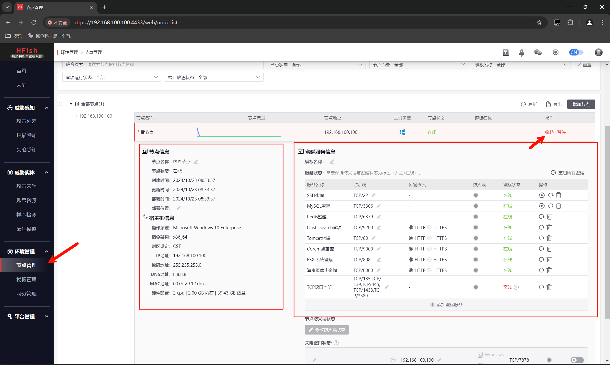

### 3.2.1. nmap扫描

这里我使用nmap对蜜罐进行简单的端口扫描，来测试一些端口开放的情况，可以看到基本上都是常用端口还是能被扫描到。

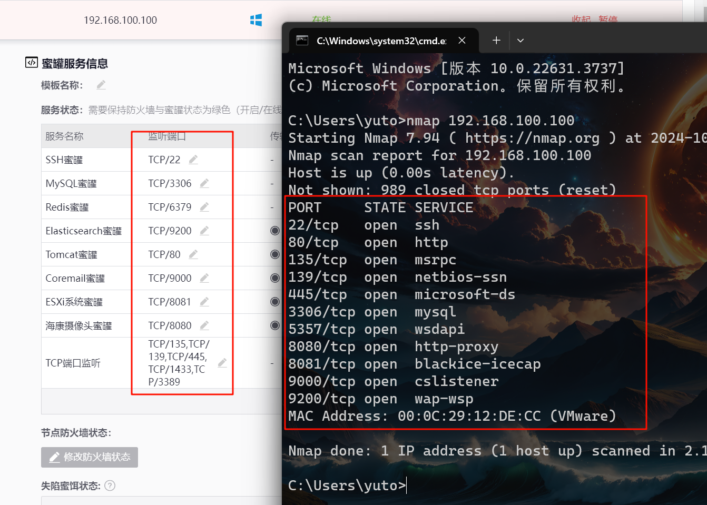

### 3.2.2. 添加更多蜜罐

这里有点被挡住了，在蜜罐服务的信息下面有添加蜜罐服务，点开就会有很多的选择了，可以根据自己的选择来判断你需要捕获什么样的攻击行为。

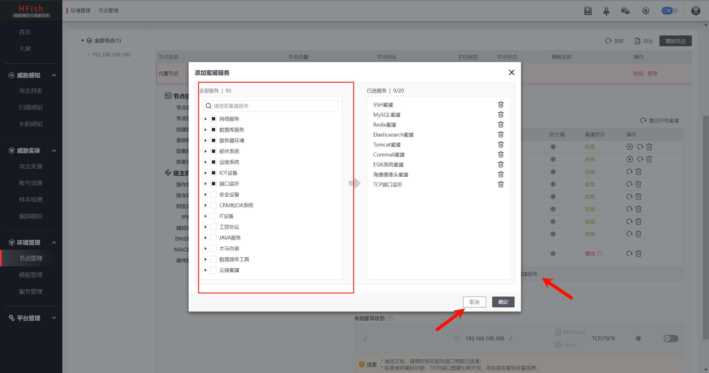

## 3.3. 模板管理

这里模板管理可以手动添加符合自己公司生产网中的业务类型，当然其中也给了很多的预设模板，也可以直接使用

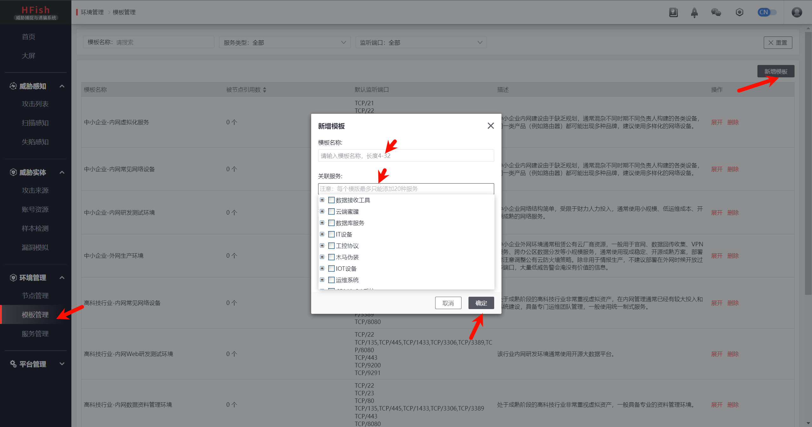

### 3.3.1. 模板替换

这里当设置好一些自己想要的模板后，可以在节点管理中替换这些模板，可以看到这里我就替换了一个模板，替换后需要等待蜜罐的状态启动起来。

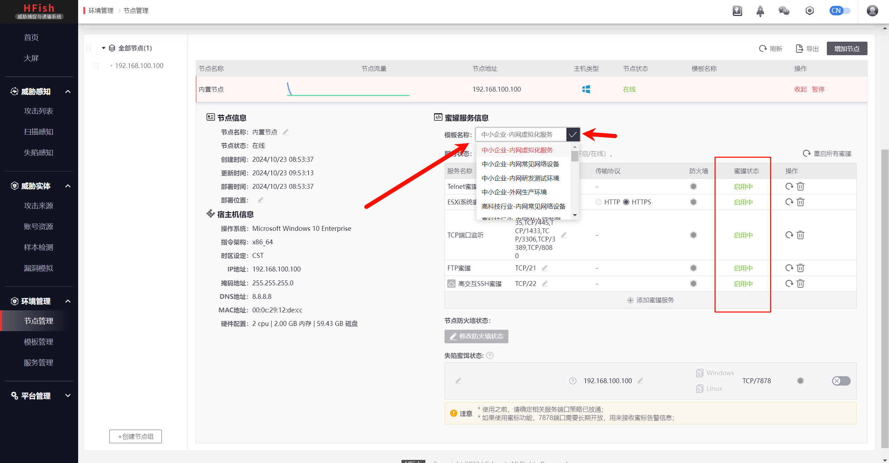

## 3.4. 服务管理

服务管理就是制作蜜罐的服务，这个需要对服务的制作有一定的了解，也不是一句两句就能说的清楚的，这里官方默认也基于了很多服务，当然你如果觉得不满意可以在右上角自己添加。

添加后就可以在节点管理中启动了。

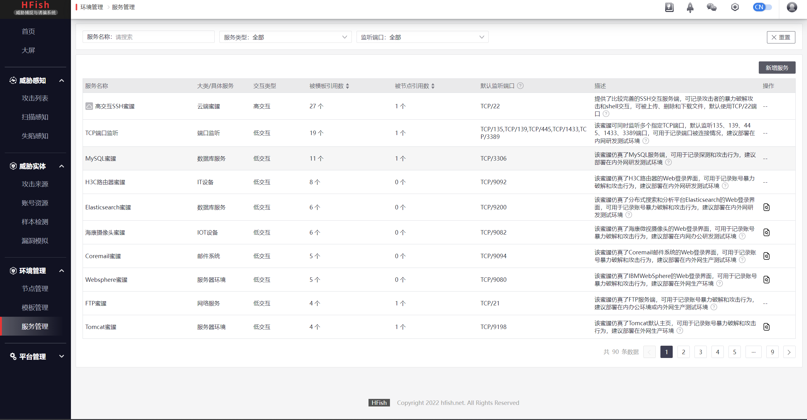

## 3.5. 漏洞模拟

在威胁实体处有一个漏洞模拟，默认也添加了很多的漏洞，当然也可以手动添加一些漏洞，当然要根据官方的规则来。

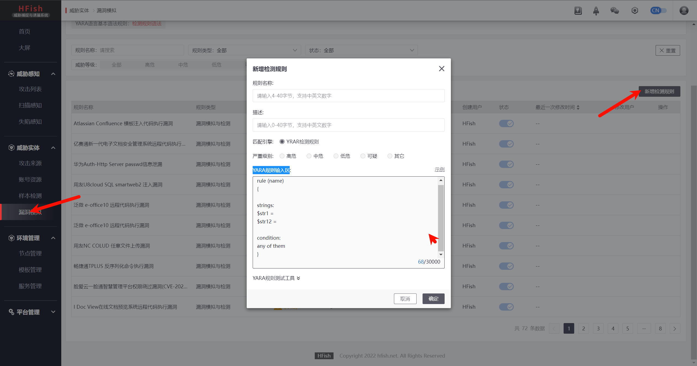

# 4. 漏洞测试

当一切部署好后，我们就可以进行漏洞测试了，这里我们添加了一个Tomcat蜜罐服务端口为9198，我们可以打开浏览器测试一下访问效果。

可以看到是一个默认的页面，而等会我们就使用goby来进行扫描测试。

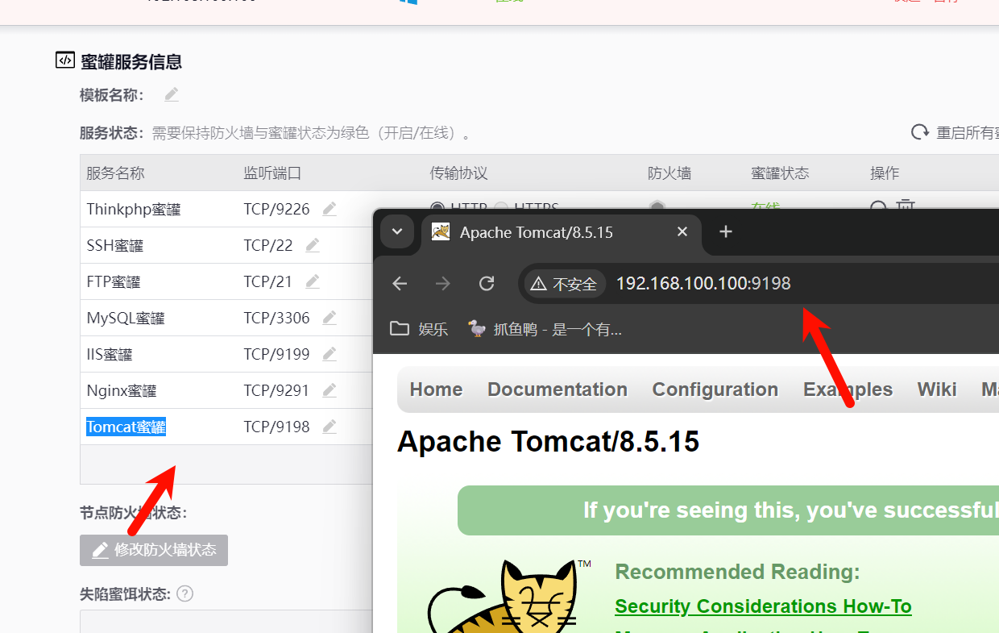

## 4.1. goby扫描测试

这里是使用goby进行扫描测试，我们等待扫描完成。

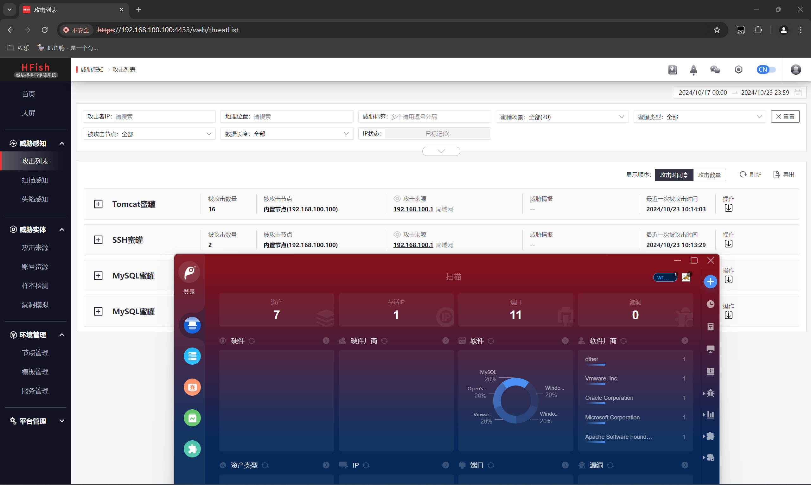

## 4.2. 威胁感知

### 4.2.1. 攻击列表

在攻击列表这里可以显示相应的蜜罐被攻击的情况，同时也可以查看详情，包括传进来的账号密码以及请求包等。

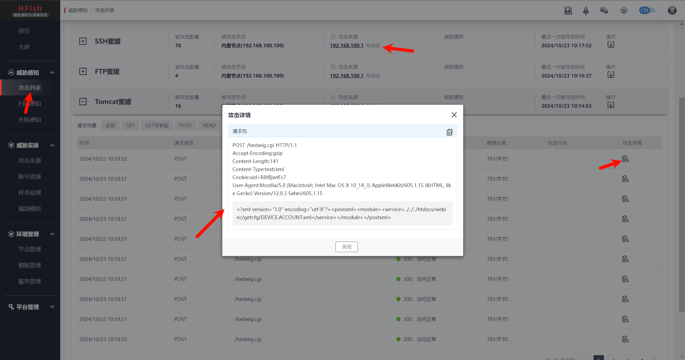

### 4.2.2. 扫描感知

通过扫描感知也可以了解到外部除了对我们开放的端口进行扫描了，还对那些端口进行扫描了，例如我使用goby进行了全端口是扫描，通过扫描感知就可以看到详细的具体那些端口被扫描了。

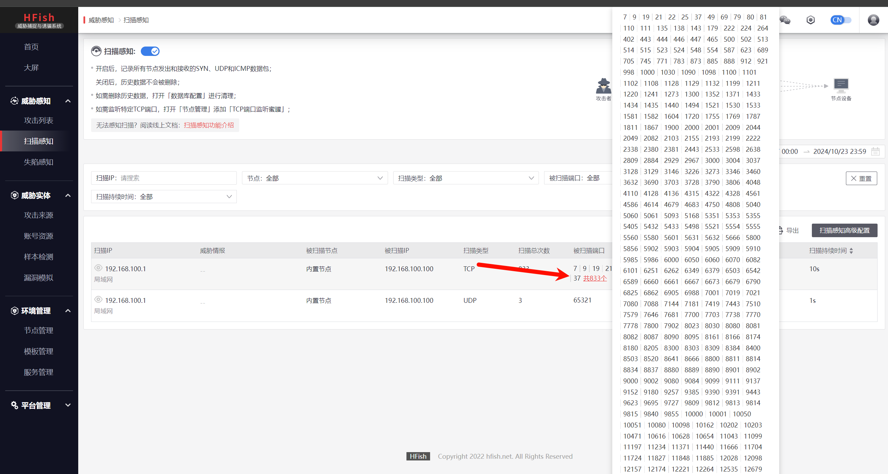

## 4.3. 威胁实体

### 4.3.1. 攻击来源

通过威胁实体中的攻击来源可以看到攻击方使用了那些已知的EXP和POC进行攻击或测试，当然你如果手动添加过漏洞模拟，可能能够检测出更多的行为。

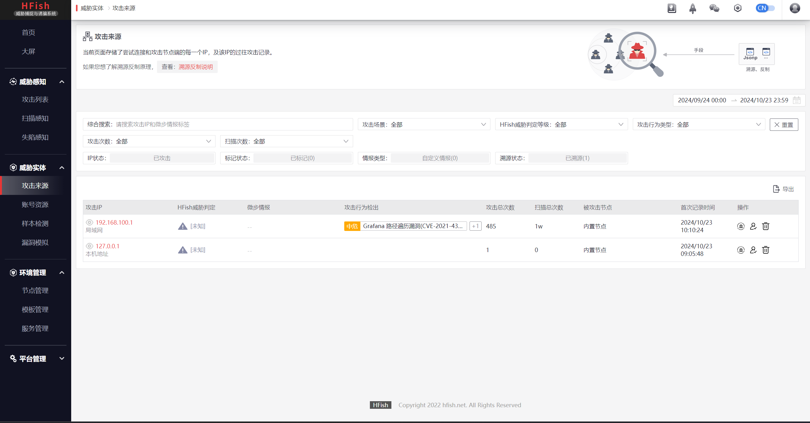

### 4.3.2. 账号资源

这里可以看到对类似登录的业务攻击者使用了那些的弱口令进行测试的，同时可以获取到攻击者的弱口令，也可以判断是否有针对性的弱口令测试。

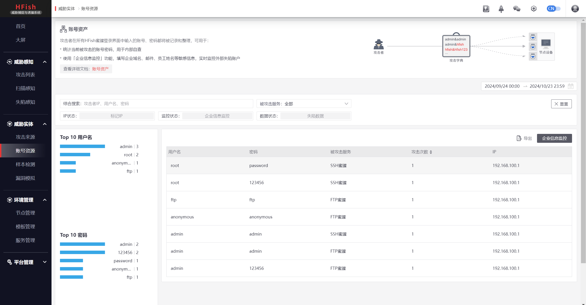

### 4.3.3. 漏洞模拟

漏洞模拟中也可以查看到漏洞被触发多少次，攻击的具体详情等。


# 5. 总结

最后还有很多的功能需要放在公网上捕获的信息会更加的直观，包括上传文件，会自动传送到微步进行测试，当然也需要该蜜罐支持连网，如果不能连网，那么很多的功能可能就无法使用。